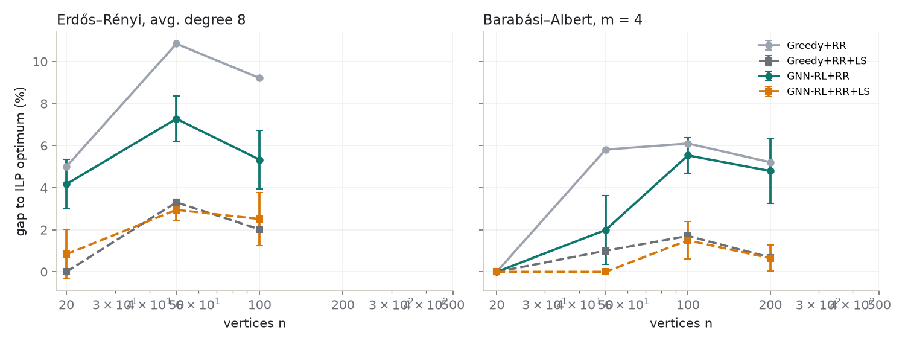
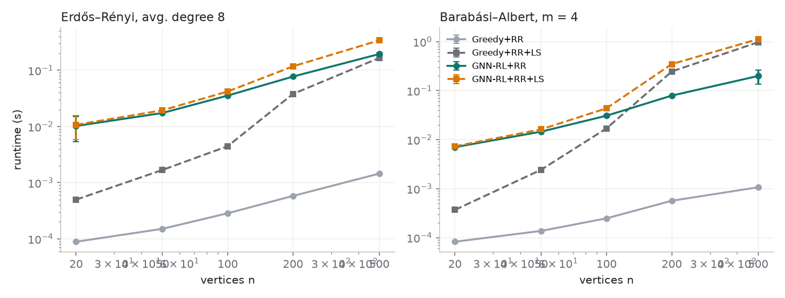
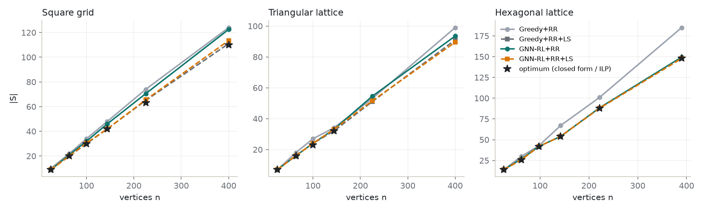
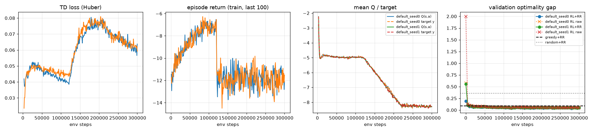
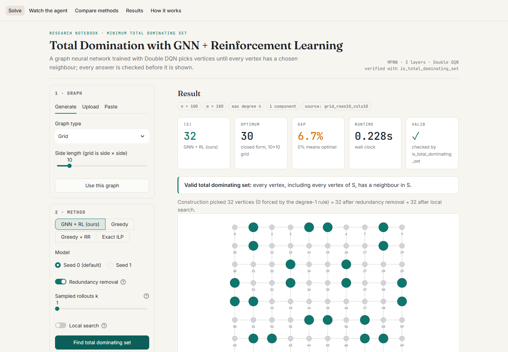
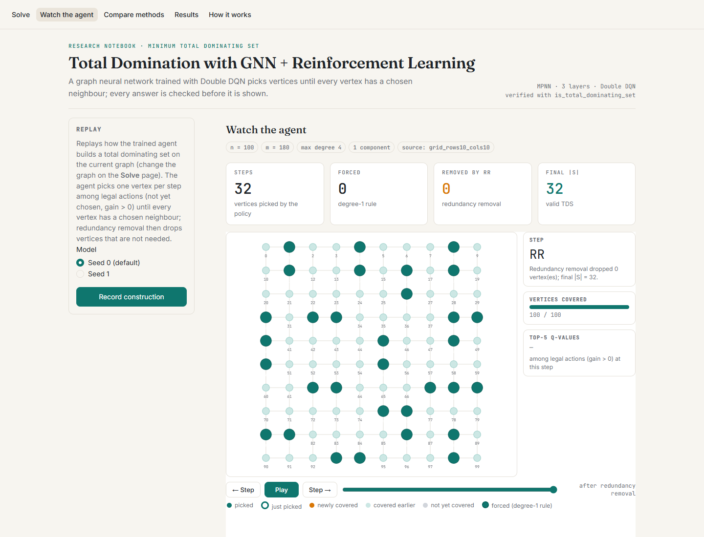
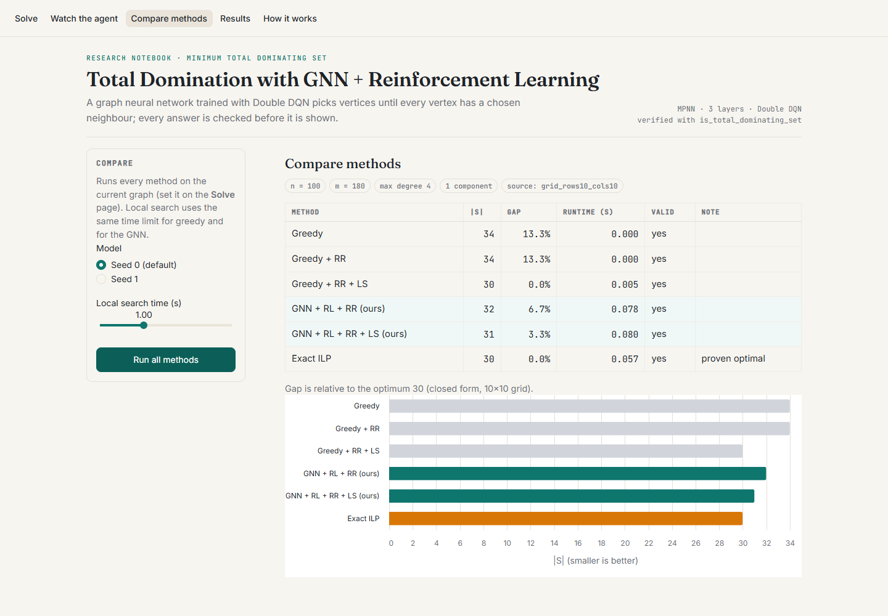

# Minimum Total Dominating Set with a GNN trained by Double DQN

This repository finds small **total dominating sets (TDS)** with a graph neural network trained by
deep reinforcement learning (Double DQN). It adapts Chen, Liu & He (2024), *Learn to solve
dominating set problem with GNN and reinforcement learning*, Applied Mathematics and Computation
474:128717, from plain domination to **total** domination. It adds a provably safe action mask, a
reduction rule, post-processing, exact ILP baselines and a test suite.

**Every solution reported by any part of this system is checked by `tds.checker`.** Every number in
`results/` was produced by the commands listed under [Reproducing the results](#reproducing-the-results).

---

## 1. Problem

Let `G = (V, E)` be a simple undirected graph. `N(v)` is the open neighbourhood (it does not contain `v`).

* **Total dominating set:** `S ⊆ V` such that every vertex, *including the vertices of S*, has a
  neighbour in `S`: `N(v) ∩ S ≠ ∅` for all `v ∈ V`.
* **Goal:** minimise `|S|`. The minimum is the total domination number `γ_t(G)`. The weighted
  variant minimises `Σ_{v∈S} w(v)` and is supported throughout.
* A TDS exists **iff G has no isolated vertex**. Every solver raises `NoTotalDominatingSetError`
  otherwise. Generated training graphs repair isolated vertices by attaching each one to a random vertex.
* Exact formulation (used as ground truth, `tds/baselines/ilp.py`):
  `min Σ_v x_v  s.t.  Σ_{u∈N(v)} x_u ≥ 1 ∀v,  x ∈ {0,1}^n`.

## 2. Changes from the base paper

| # | Base paper (dominating set) | This system (total dominating set) | Reason |
|---|---|---|---|
| C1 | Picking `v` covers `N[v]` | Picking `v` covers **only `N(v)`**. No self-loops in the adjacency | Definition of total domination |
| C2 | After picking `v`, all of `v ∪ N(v)` become forbidden | Legal actions: `v ∉ S` and `gain(v) > 0`, with `gain(v)` = #uncovered vertices in `N(v)` | The base rule makes chosen vertices pairwise non-adjacent, so it can **never** produce a TDS. The gain mask loses no optimum (§4) |
| C3 | One bit per vertex (dominated) | Separate `selected` and `covered` channels + 8 more features | A selected vertex can still be uncovered |
| C4 | Reward = change in dominated count | Reward −1 per pick (−w(v)/mean w when weighted), γ = 1. Return = −\|S \\ forced\| exactly | The return equals the objective. The paper's reward is kept as an ablation |
| C5 | Stop when everything is dominated | Stop when every vertex has a selected neighbour | Definition |
| C6 | No preprocessing | Degree-1 rule: the neighbour of a leaf is in every TDS → pre-selected (`forced`) | Safe; shrinks the problem |
| C7 | No post-processing | Redundancy removal (RR) and optional time-limited local search (LS) | Both provably keep feasibility |
| C8 | Dense `n×n` matrices | Sparse `edge_index` message passing in pure PyTorch | Inference on 10⁵ vertices |
| C9 | Graph summary = sum | Graph summary = concat(mean, max) | Sums grow with n |
| C10 | Replay buffer 500; ER p = 0.4 only | Buffer 100k; ER/BA/WS/RGG/lattices; size curriculum | Avoid overfitting one density |
| C11 | Greedy only | Correct greedy, greedy+RR(+LS), exact ILP, paper-faithful ablation | Needed for evaluation |

Kept from the base paper: the 3-layer MPNN encoder, the Eq. 6-style Q head (graph summary ‖ vertex
embedding), Double DQN with a soft-updated target network, Adam (lr 1e-4), ε-greedy, and evaluation
on ER, BA, grid, triangular and hexagonal lattices.

## 3. MDP (`tds/env.py`)

* **State.** Per-vertex features `selected, covered, forced, deg/Δ, gain/deg, gain/Δ, covered-neighbour
  fraction, selected-neighbour fraction, valid_action, w/max w`. Global features: covered fraction,
  `|S|/n`, `log(n)/10`.
* **Action.** A vertex with `valid_action = 1` (`v ∉ S`, `gain(v) > 0`). Invalid actions get Q = −∞,
  both when acting and in the Double-DQN target argmax.
* **Transition.** `S ← S ∪ {v}`; each `u ∈ N(v)` becomes covered (never `v` itself). Features are
  updated incrementally for `v`, `N(v)` and `N(u)` of the newly covered `u` only. A test checks they
  equal a from-scratch recomputation after random action sequences.
* **Reward.** `unit` (default) `r = −1`; `shaped` `r = −1 + β(Φ(s') − Φ(s))` with
  `Φ = −#uncovered/Δ`, which is potential-based and leaves the optimal policy unchanged when γ = 1;
  `paper` `r = α(#newly covered − #already covered in N(v))` (ablation only).
* **Termination.** All vertices are covered. Episodes that the forced rule alone solves have zero steps.

## 4. Why the `gain > 0` mask loses no optimum

Let `S*` be a minimum TDS. It is minimal, so every `v ∈ S*` has a *private neighbour* `p` with
`N(p) ∩ S* = {v}`. (Otherwise `S* \ {v}` would still be a TDS.) Insert the forced vertices first,
which belong to every TDS, then the rest of `S*` in any order. When `v` is inserted, its private
neighbour `p` is still uncovered, because only `v` can cover it. So `gain(v) ≥ 1` and `v` is a legal
action. Every minimum TDS is therefore reachable under the mask. The MDP is deterministic with γ = 1
and reward −1 per step, so the optimal policy attains `γ_t(G)`. `tests/test_env.py::test_mask_preserves_an_optimum`
checks this on 80 graphs by replaying ILP optima in random orders.

## 5. Model and training

* **Encoder** (`tds/model.py`): `h⁰ = ReLU(W_in x)`, then K = 3 layers of
  `m_v = Σ_{u∈N(v)} ReLU(W_msg[h_u ‖ h_v])`, `a_v = [m_v ‖ m_v/deg v]`,
  `h_v ← LayerNorm(h_v + ReLU(W2 ReLU(W1[h_v ‖ a_v])))`, hidden size 64.
  `W_msg[h_u ‖ h_v]` is computed as `W_a h_u + W_b h_v`, with both projections applied per vertex
  before gathering along edges. It is the same function and halves edge-level memory. GIN and
  single-head GAT encoders exist for the ablations.
* **Q head:** `g = [mean_v h ‖ max_v h ‖ global]`, `Q(v) = w5ᵀ ReLU([W6 g ‖ W7 h_v])`.
* **Batching:** disjoint union with node offsets and a `batch` vector. Per-graph max/argmax use
  `scatter_reduce(amax/amin)`. No PyTorch Geometric is needed.
* **Double DQN** (`tds/agent.py`, `tds/train.py`): Huber loss (MSE optional), Adam 1e-4, grad-norm
  clip 10, soft target update τ = 0.005 every gradient step, γ = 1, n-step optional. Replay holds 100k
  compact transitions `(graph_id, S_t, a, R, S_{t+n}, done)`, rebuilt into features at sampling time.
  Batch 64, warm-up 2k, one gradient step per 2 environment steps (8 parallel environments),
  ε 1 → 0.05 linearly over the first 30% of steps.
* **Training graphs:** a fresh graph every episode from a seeded mixture: ER (avg degree U[3,15]),
  BA (m ∈ 1..8), WS (k ∈ {4,6}, p ∈ [0.05,0.3]), random geometric, and grid/triangular/hexagonal
  lattices. Curriculum n ∈ [20,50] for the first 40% of steps, then [20,100]. 300k steps.
* **Validation:** every 5k steps on 200 fixed graphs (n = 50–100, mixed families, seed disjoint from
  training and test). Optima are cached from the ILP (all 200 proven optimal). The metric is the mean
  optimality gap after RR. `best.pt` is saved by that metric, `last.pt` always. Logs go to CSV and
  TensorBoard (`runs/<name>_seed<k>/`).

## 6. Post-processing (`tds/postprocess.py`)

* **Redundancy removal:** try non-forced `v ∈ S` in ascending (Q at selection, degree) order and drop
  `v` if every `u ∈ N(v)` has `cover_count[u] ≥ 2`. The result is a *minimal* TDS (tested).
* **Local search (time-limited):** "2-for-1" moves (add `c ∉ S`, remove two vertices that became
  removable) and "1-for-1 swap + RR" plateau moves with a tabu tenure. It returns the best set seen,
  which is checked. In debug mode feasibility is asserted after every move.

## 7. Installation

```bash
python -m venv .venv
.venv\Scripts\activate            # Windows  (Linux/macOS: source .venv/bin/activate)
pip install -r requirements.txt   # CUDA torch: pip install torch --index-url https://download.pytorch.org/whl/cu128
pytest -q                         # 394 tests
```

`requirements-lock.txt` lists the exact versions used for the reported results.

## 8. Usage

```python
from tds import solve
res = solve(G, method="rl", checkpoint="checkpoints/best.pt", rr=True, ls_time=1.0)
res.vertices, res.size, res.runtime, res.is_valid      # is_valid is always computed by the checker
```

`G` may be a `tds.Graph`, a networkx graph, an adjacency list or a file path. Methods: `rl`, `greedy`,
`greedy_rr`, `greedy_rr_ls`, `ilp`, `paper_faithful`.

```bash
python -m tds.train    --config configs/default.yaml --seed 0
python -m tds.evaluate --config configs/eval_e1.yaml
python -m tds.solve    --graph path/to/edges.txt --method rl --out solution.json --plot solution.png
streamlit run app/streamlit_app.py
```

`checkpoints/best.pt` is the main model selected as described in [Results](#results).
Every training run also keeps `checkpoints/<name>_seed<k>/{best,last}.pt`.

On graphs with more than 1,000 vertices, RL inference by default adds up to ⌈n/1000⌉ vertices per
forward pass (`multi_select="auto"`), re-checking each pick against the environment. This is an
inference-time approximation of the one-vertex-per-step policy, made for speed. Pass
`multi_select=1` for the exact greedy policy.

## 9. Tests (`pytest -q`)

* Checker semantics (open neighbourhood), fast vs. reference checker, isolated-vertex errors.
* Closed forms, all matched by the ILP with a proof of optimality: `γ_t(P_n) = γ_t(C_n) = ⌊n/2⌋+⌈n/4⌉−⌊n/4⌋`
  (n = 3–29), `γ_t(K_n) = γ_t(K_{1,m}) = γ_t(K_{a,b}) = 2`, Petersen = 4, and n×n grids
  `(2m+1)(2m+r)` for n = 4m+r (n = 2–12). On all of these, greedy and greedy+RR are valid and lie
  between γ_t and `H(Δ)·γ_t`.
* ILP (CP-SAT and HiGHS) equals brute force on 200 random graphs with n ≤ 10.
* The forced rule is contained in *every* minimum TDS (all minimum sets enumerated, 150 graphs).
* Environment: incremental features equal recomputed features, a `gain = 0` action is never legal,
  zero-step episodes work, reward modes behave as specified, and the mask preserves an optimum.
* Model: batching equals single-graph evaluation, invalid actions get −∞, permutation equivariance,
  per-graph argmax, replay reconstruction equals the environment state.
* Every solver (greedy, greedy+RR, RL, RL+RR, RL+RR+LS, sampled RL) returns a valid TDS on 1,000
  random graphs, including trees, disconnected graphs and graphs with leaves. RR output is minimal.
  Local search never worsens the solution and stays feasible after every move.

## Results

<!-- RESULTS:BEGIN (generated by scripts/readme_results.py from results/summary.json and checkpoints/model_info.json) -->
All numbers below were produced by `scripts/finalize_models.py` and `scripts/run_final.py` (see [Reproducing the results](#reproducing-the-results)). GNN results are mean ± std across the 2 training seeds; greedy methods are deterministic. **2,192 solutions were checked with `is_total_dominating_set`: 100% valid.**

### Model

| seed | training steps | best checkpoint (step) | val. gap, GNN+RR | val. gap, GNN raw | val. optimal (GNN+RR) | val. gap, greedy+RR |
|---|---|---|---|---|---|---|
| 0 | 300,000 | 280,000 | 3.85% | 4.27% | 55.5% | 8.64% |
| 1 | 300,000 | 120,000 | 4.41% | 4.65% | 52.0% | 8.64% |

MPNN encoder, 3 layers, hidden size 64, meanmax readout, 88,129 parameters. Validation: 200 fixed graphs (n = 50–100; ER, BA, WS, random geometric, lattices), all optima proven by the exact ILP. Gap = mean (|S| − optimum) / optimum. best.pt = checkpoint with the lowest gap after redundancy removal (RR).

### Headline (E1, ER + BA, n = 20–500)

Mean gap to the proven optimum over the 139 of 200 E1 instances where the ILP proved optimality (61 not proven, excluded):

| method | mean gap |
|---|---|
| Greedy | 7.05% |
| Greedy + RR | 6.00% |
| Greedy + RR + LS | 1.24% |
| GNN-RL | 4.34% ± 0.90 |
| GNN-RL + RR | 4.15% ± 1.09 |
| GNN-RL + RR + LS | 1.20% ± 0.11 |

Local search time limit: 1 s for both greedy and GNN.

### E1 — random graphs (gap to ILP optimum, proven instances only)

| family | n | graphs | ILP proven | optimum (mean, proven) | Greedy gap % | Greedy+RR gap % | Greedy+RR+LS gap % | GNN-RL gap % | GNN-RL+RR gap % | GNN-RL+RR+LS gap % |
|---|---|---|---|---|---|---|---|---|---|---|
| er_d8 | 20 | 20 | 20 | 3.0 | 6.67 | 5.00 | 0.00 | 4.17 ± 1.18 | 4.17 ± 1.18 | 0.83 ± 1.18 |
| er_d8 | 50 | 20 | 20 | 7.8 | 11.47 | 10.84 | 3.30 | 7.28 ± 1.07 | 7.28 ± 1.07 | 2.95 ± 0.51 |
| er_d8 | 100 | 20 | 19 | 15.9 | 10.51 | 9.21 | 2.02 | 5.33 ± 1.38 | 5.33 ± 1.38 | 2.51 ± 1.27 |
| er_d8 | 200 | 20 | 0 | -- | -- | -- | -- | -- | -- | -- |
| er_d8 | 500 | 20 | 0 | -- | -- | -- | -- | -- | -- | -- |
| ba_m4 | 20 | 20 | 20 | 3.0 | 0.00 | 0.00 | 0.00 | 0.83 ± 1.18 | 0.00 ± 0.00 | 0.00 ± 0.00 |
| ba_m4 | 50 | 20 | 20 | 6.3 | 6.64 | 5.81 | 1.00 | 1.99 ± 1.63 | 1.99 ± 1.63 | 0.00 ± 0.00 |
| ba_m4 | 100 | 20 | 20 | 12.3 | 6.87 | 6.10 | 1.70 | 5.72 ± 0.59 | 5.54 ± 0.84 | 1.50 ± 0.88 |
| ba_m4 | 200 | 20 | 20 | 22.9 | 7.36 | 5.21 | 0.68 | 5.12 ± 1.68 | 4.79 ± 1.53 | 0.65 ± 0.62 |
| ba_m4 | 500 | 20 | 0 | -- | -- | -- | -- | -- | -- | -- |





<details><summary>E1 solution sizes and runtimes</summary>

| family | n | Greedy |S| | Greedy time s | Greedy+RR |S| | Greedy+RR time s | Greedy+RR+LS |S| | Greedy+RR+LS time s | GNN-RL |S| | GNN-RL time s | GNN-RL+RR |S| | GNN-RL+RR time s | GNN-RL+RR+LS |S| | GNN-RL+RR+LS time s |
|---|---|---|---|---|---|---|---|---|---|---|---|---|---|
| er_d8 | 20 | 3.2 | 0.000 | 3.1 | 0.000 | 3.0 | 0.000 | 3.1 ± 0.0 | 0.010 ± 0.005 | 3.1 ± 0.0 | 0.010 ± 0.005 | 3.0 ± 0.0 | 0.011 ± 0.005 |
| er_d8 | 50 | 8.7 | 0.000 | 8.6 | 0.000 | 8.0 | 0.002 | 8.3 ± 0.1 | 0.017 ± 0.000 | 8.3 ± 0.1 | 0.017 ± 0.000 | 8.0 ± 0.0 | 0.019 ± 0.000 |
| er_d8 | 100 | 17.6 | 0.000 | 17.4 | 0.000 | 16.2 | 0.004 | 16.8 ± 0.2 | 0.035 ± 0.001 | 16.8 ± 0.2 | 0.036 ± 0.001 | 16.4 ± 0.2 | 0.042 ± 0.002 |
| er_d8 | 200 | 35.1 | 0.000 | 34.5 | 0.001 | 32.5 | 0.038 | 33.1 ± 0.2 | 0.077 ± 0.000 | 33.1 ± 0.2 | 0.077 ± 0.000 | 32.1 ± 0.1 | 0.118 ± 0.000 |
| er_d8 | 500 | 88.5 | 0.001 | 87.2 | 0.001 | 81.7 | 0.166 | 83.0 ± 0.6 | 0.194 ± 0.009 | 82.9 ± 0.7 | 0.195 ± 0.009 | 80.5 ± 0.0 | 0.342 ± 0.036 |
| ba_m4 | 20 | 3.0 | 0.000 | 3.0 | 0.000 | 3.0 | 0.000 | 3.0 ± 0.0 | 0.007 ± 0.000 | 3.0 ± 0.0 | 0.007 ± 0.000 | 3.0 ± 0.0 | 0.007 ± 0.000 |
| ba_m4 | 50 | 6.7 | 0.000 | 6.7 | 0.000 | 6.3 | 0.002 | 6.4 ± 0.1 | 0.014 ± 0.000 | 6.4 ± 0.1 | 0.015 ± 0.000 | 6.3 ± 0.0 | 0.016 ± 0.000 |
| ba_m4 | 100 | 13.2 | 0.000 | 13.1 | 0.000 | 12.5 | 0.017 | 13.0 ± 0.1 | 0.031 ± 0.001 | 13.0 ± 0.1 | 0.031 ± 0.001 | 12.5 ± 0.1 | 0.044 ± 0.002 |
| ba_m4 | 200 | 24.6 | 0.000 | 24.1 | 0.001 | 23.1 | 0.246 | 24.1 ± 0.4 | 0.079 ± 0.000 | 24.1 ± 0.4 | 0.079 ± 0.000 | 23.1 ± 0.1 | 0.349 ± 0.038 |
| ba_m4 | 500 | 59.5 | 0.001 | 58.7 | 0.001 | 56.1 | 0.974 | 58.4 ± 0.5 | 0.199 ± 0.064 | 58.2 ± 0.3 | 0.199 ± 0.063 | 56.0 ± 0.1 | 1.126 ± 0.067 |

</details>

### E2 — lattices, zero-shot (|S|)

| lattice | n | closed form | ILP | Greedy | Greedy+RR | Greedy+RR+LS | GNN-RL | GNN-RL+RR | GNN-RL+RR+LS |
|---|---|---|---|---|---|---|---|---|---|
| grid | 25 | 9 | 9 | 10.0 | 10.0 | 9.0 | 9.0 ± 0.0 | 9.0 ± 0.0 | 9.0 ± 0.0 |
| grid | 64 | 20 | 20 | 22.0 | 22.0 | 20.0 | 22.5 ± 0.7 | 21.0 ± 1.4 | 20.0 ± 0.0 |
| grid | 100 | 30 | 30 | 34.0 | 34.0 | 30.0 | 32.0 ± 0.0 | 32.0 ± 0.0 | 30.5 ± 0.7 |
| grid | 144 | 42 | 42 | 48.0 | 48.0 | 42.0 | 46.5 ± 0.7 | 46.0 ± 0.0 | 42.0 ± 0.0 |
| grid | 225 | 63 | 63 | 74.0 | 74.0 | 65.0 | 70.5 ± 2.1 | 70.5 ± 2.1 | 65.5 ± 0.7 |
| grid | 400 | 110 | 110 | 124.0 | 124.0 | 111.0 | 122.5 ± 6.4 | 122.5 ± 6.4 | 113.5 ± 0.7 |
| hex | 26 | -- | 14 | 14.0 | 14.0 | 14.0 | 14.0 ± 0.0 | 14.0 ± 0.0 | 14.0 ± 0.0 |
| hex | 62 | -- | 26 | 32.0 | 30.0 | 26.0 | 27.0 ± 1.4 | 27.0 ± 1.4 | 26.0 ± 0.0 |
| hex | 98 | -- | 42 | 50.0 | 43.0 | 42.0 | 42.0 ± 0.0 | 42.0 ± 0.0 | 42.0 ± 0.0 |
| hex | 142 | -- | 54 | 72.0 | 67.0 | 54.0 | 55.0 ± 1.4 | 54.0 ± 0.0 | 54.0 ± 0.0 |
| hex | 222 | -- | 88 | 112.0 | 101.0 | 88.0 | 88.5 ± 0.7 | 88.5 ± 0.7 | 88.0 ± 0.0 |
| hex | 390 | -- | 148 | 196.0 | 185.0 | 148.0 | 150.0 ± 1.4 | 149.5 ± 0.7 | 148.0 ± 0.0 |
| tri | 25 | -- | 7 | 8.0 | 7.0 | 7.0 | 7.5 ± 0.7 | 7.0 ± 0.0 | 7.0 ± 0.0 |
| tri | 64 | -- | 16 | 18.0 | 18.0 | 16.0 | 16.0 ± 0.0 | 16.0 ± 0.0 | 16.0 ± 0.0 |
| tri | 100 | -- | 23 | 27.0 | 27.0 | 24.0 | 24.0 ± 0.0 | 24.0 ± 0.0 | 24.0 ± 0.0 |
| tri | 144 | -- | 32 | 34.0 | 34.0 | 32.0 | 33.0 ± 1.4 | 33.0 ± 1.4 | 33.0 ± 1.4 |
| tri | 225 | -- | 50 (not proven, bound 49) | 53.0 | 53.0 | 51.0 | 54.5 ± 2.1 | 54.5 ± 2.1 | 51.5 ± 0.7 |
| tri | 400 | -- | 87 (not proven, bound 81) | 99.0 | 99.0 | 91.0 | 94.0 ± 2.8 | 93.5 ± 2.1 | 89.5 ± 0.7 |

Grid closed form: γ_t(n×n) = (2m+1)(2m+r) with n = 4m+r (OEIS A302488; verified by the ILP for n ≤ 12 in `tests/test_closed_forms.py`).



### E3 — scale (n = 10,000)

| graph | n | m | Greedy |S| | Greedy time s | Greedy+RR |S| | Greedy+RR time s | GNN-RL |S| | GNN-RL time s | GNN-RL+RR |S| | GNN-RL+RR time s |
|---|---|---|---|---|---|---|---|---|---|---|
| er_d8_n10000 | 10000 | 40184 | 1783.0 | 0.03 | 1765.0 | 0.03 | 1677.5 ± 30.4 | 2.15 ± 0.01 | 1674.5 ± 27.6 | 2.16 ± 0.01 |
| ba_m3_n10000 | 10000 | 29991 | 1424.0 | 0.02 | 1410.0 | 0.02 | 1407.5 ± 16.3 | 1.45 ± 0.03 | 1397.5 ± 4.9 | 1.45 ± 0.03 |

**Data separation.** Training-graph seeds checked: 120,620; validation: 200; test: 2,379. Overlaps: train–val 0, train–test 0, val–test 0. (lattice test graphs are deterministic (no seed); training lattices are small (n<=100) random-size patches.)

**Training curves** (both seeds):


<!-- RESULTS:END -->

## How to run the app

```bash
streamlit run app/streamlit_app.py
```

The app opens at http://localhost:8501 with five pages: **Solve** (upload, generate or paste a graph, choose a
method, see the verified total dominating set on an interactive graph), **Watch the agent** (step-by-step replay
of the GNN's construction and of redundancy removal), **Compare methods**, **Results** (reads
`results/summary.json` and `checkpoints/model_info.json`), and **How it works**. It runs on CPU and uses the GPU
when available.

| Solve | Watch the agent |
|---|---|
|  |  |
| **Compare methods** | **How it works** |
|  |  |

## Reproducing the results

Delivered results (2 seeds, reduced experiments):

```bash
python scripts/make_test_sets.py                                  # fixed test sets in data/test/
python -m tds.train --config configs/default.yaml --seed 0 --resume  # 300k steps (resumable)
python -m tds.train --config configs/default.yaml --seed 1 --resume
python scripts/finalize_models.py                                 # checkpoints/best.pt, seed1_best.pt, model_info.json
python scripts/run_final.py ilp                                   # exact ILP references (30 s limit)
python scripts/run_final.py verify                                # re-solve + verify reused ILP rows
python scripts/_ilp_recover.py                                    # 60 s re-solve where only the earlier 60 s run had a proof
python scripts/run_final.py timed                                 # greedy / RL rows, run on an idle machine
python scripts/run_final.py report                                # results/summary.json, tables, plots
python scripts/readme_results.py                                  # writes the Results section above
python scripts/plot_training.py runs/default_seed0 runs/default_seed1 --out results/final/training_curves.png
pytest -q
```

Not yet run (full plan in the original specification):

```bash
for s in 2 3 4; do python -m tds.train --config configs/default.yaml --seed $s --resume; done
for c in configs/ablation_*.yaml; do python -m tds.train --config $c --seed 0 --resume; done   # 100k steps each
python scripts/run_e1.py; python scripts/run_e2.py; python scripts/run_e3.py   # full E1–E3 (configs/eval_e*.yaml)
python scripts/run_e5.py; python scripts/run_e6.py                              # ablations, sampled rollouts
python scripts/run_e4.py                                                        # after placing files in data/benchmarks/
```

`scripts/train_queue.py` runs several trainings in sequence, and `scripts/guarded_run.py` pauses a resumable job
when free RAM gets low. Results land in `results/`; every solution is verified.

## Limitations

* **Two training seeds.** Results are mean ± std over seeds 0 and 1 (300k steps each). The spec asked for 5;
  seeds 2–4 were cancelled to meet the delivery deadline.
* **Ablations (E5) and sampled-rollout study (E6) were not run.** Their configs and scripts are in the repository
  (`configs/ablation_*.yaml`, `configs/eval_e5.yaml`, `scripts/run_e5.py`, `scripts/run_e6.py`). The ablation
  configs train for 100k steps and must be compared with `configs/ablation_baseline_100k.yaml`.
* **Reduced experiments.** E1 uses ER (avg. degree 8) and BA (m = 4) only, n ≤ 500, 20 graphs per cell; E2 uses
  lattices with n ≤ 400; E3 uses one ER and one BA graph with n = 10,000, so the largest test graph is 10⁴ vertices.
  E4 (real benchmark graphs) was not run because it needs files the team downloads.
* **ILP limits.** Exact ILP (CP-SAT) ran with a 30 s limit (60 s for 21 E1 instances reused from an earlier run);
  instances without a proof of optimality are excluded from gap figures and counted in the tables.
* **Not compared with Huang & He (2026)**, *A Reinforcement Learning Framework for Minimize Total Dominating Set
  Problem*, Advances in Applied Mathematics 15(3):338–350 (code: github.com/Hyelow0/RL-Total-Dominating-main).
  `scripts/run_external_huang_he.md` explains how to run it on our saved test graphs.
* **Runtime comparisons** are on one laptop (RTX 3050 6 GB, Python implementation of greedy/RR/LS); the GNN uses
  the GPU. On graphs with > 1,000 vertices the GNN adds up to ⌈n/1000⌉ vertices per forward pass (each pick
  re-checked), an approximation of the one-vertex-per-step policy.
* **Sampled rollouts** in the app use temperature 0.1, which was not tuned on a held-out set.
* **Training loss** does not decrease monotonically (it grows with the magnitude of the Q-values and when the size
  curriculum switches at 40% of training); model selection uses the validation gap, not the loss.
